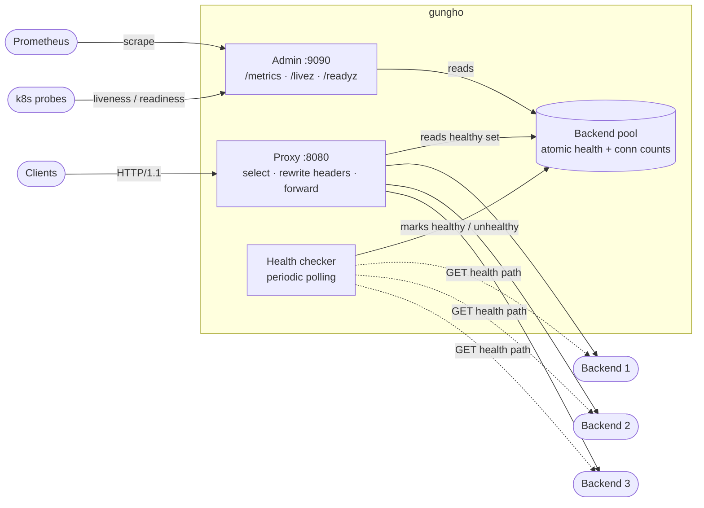
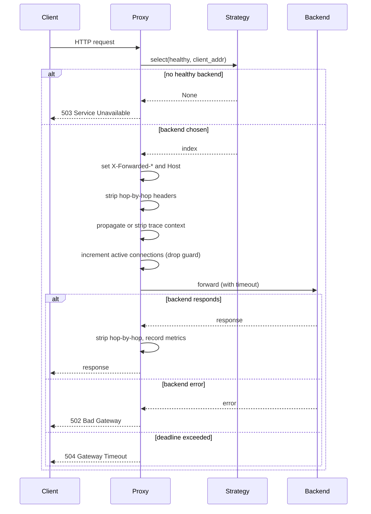
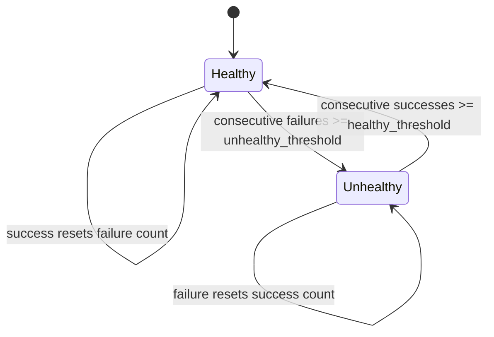

# gungho

An HTTP/1.1 reverse proxy and load balancer written in Rust, built on Tokio and hyper.

> **Learning project.** gungho is a personal project for learning systems programming in Rust:
> async runtimes, lock-free concurrency, the proxy data path, and observability. AI was used
> only as a learning assistant in a Socratic mentor mode (see [Learning approach](#learning-approach)).
> The code here was written by hand. AI was not used to generate it.

## Status

The library compiles and the test suite passes (75 tests). The individual subsystems are built
and unit-tested, but the binary is not wired together yet. Running `gungho` today only initialises
logging and exits. See [Roadmap](#roadmap) for what remains.

```bash
cargo test    # 75 passed
cargo clippy  # pedantic + nursery + unwrap_used, clean
cargo fmt     # nightly, imports_granularity = Module
```

## What works today

| Subsystem | Module | State |
|---|---|---|
| Config parsing and validation (TOML) | `config.rs` | Done |
| Backend pool with atomic health and connection counters | `backend.rs` | Done |
| Round Robin | `lb/round_robin.rs` | Done |
| Smooth Weighted Round Robin (nginx SWRR) | `lb/weighted_round_robin.rs` | Done |
| Least Connections | `lb/least_connections.rs` | Done |
| IP Hash | `lb/ip_hash.rs` | Done |
| Random | `lb/random.rs` | Done |
| Proxy data path (forward, header rewrite, timeouts) | `proxy.rs` | Done |
| W3C Trace Context propagation at the header level | `proxy.rs` | Done |
| Active health checker (periodic polling, thresholds) | `health.rs` | Done |
| Prometheus metrics | `metrics.rs` | Done |
| Admin server (`/metrics`, `/livez`, `/readyz`) | `admin.rs` | Done |
| Structured logging (pretty + JSON via `tracing`) | `logging.rs` | Done |
| Main orchestration (wire it all together) | `main.rs` | Not started |
| Hot config reload | `reload.rs` | Stub |
| Graceful shutdown | `shutdown.rs` | Stub |

## Architecture

gungho uses a two-port design. Client traffic is proxied on one port; operational endpoints
(metrics and health probes) live on a separate admin port so they can be scraped and probed
without touching the data path.



### Request path

Every request picks a backend from the cached healthy set, rewrites headers, and forwards
with a timeout. Connection counts are tracked with a drop guard, so the counter decrements
even if the request panics or returns early.



### Health state machine

The checker polls each backend on an interval and counts consecutive results. A backend flips
state only after crossing the configured threshold, which avoids flapping on a single blip.



## Load balancing

All algorithms implement one trait and are built through a factory keyed off the config enum.

```rust
pub trait LoadBalancingStrategy: Send + Sync {
    fn select(&self, backends: &[Arc<Backend>], client_addr: Option<&SocketAddr>) -> Option<usize>;
    fn algorithm(&self) -> &Algorithm;
}
```

`select` returns an index into the healthy slice, or `None` when the slice is empty. Only IP Hash
reads `client_addr`; the others ignore it.

| Algorithm | Selection basis | State held |
|---|---|---|
| `round_robin` | Rotating counter modulo backend count | `AtomicUsize` |
| `weighted_round_robin` | Smooth Weighted Round Robin (SWRR), proportional to weight | Per-backend credit |
| `least_connections` | Backend with fewest active connections | None (reads pool) |
| `ip_hash` | Hash of client IP, stable per client | None |
| `random` | Uniform random index | None |

Weighted Round Robin uses the same smooth algorithm as nginx: each pass adds every backend's
weight to its running credit, the highest credit wins, then the total weight is subtracted from
the winner. Weights `[5, 1, 1]` produce a `5:1:1` split without bursting all five requests to the
first backend in a row.

## Configuration

Config is TOML, parsed and validated through `Config::from_file`. Validation rejects an empty
backend list, duplicate addresses, and addresses that do not parse as a socket address.

```toml
listen_addr = "0.0.0.0:8080"
admin_addr  = "0.0.0.0:9090"
algorithm   = "round_robin"   # round_robin | weighted_round_robin | least_connections | ip_hash | random
max_connections = 1000        # 0 = unlimited
log_format = "pretty"          # pretty | json

[[backends]]
addr = "127.0.0.1:3000"
weight = 1

[[backends]]
addr = "127.0.0.1:3001"
weight = 2

[health_check]
path = "/health"
interval = 5            # seconds between checks
timeout = 3             # seconds per check
healthy_threshold = 3   # successes before a backend returns to rotation
unhealthy_threshold = 3 # failures before a backend leaves rotation

[timeouts]
connect = 5
read = 30
write = 30
```

Most fields have defaults, so a minimal config is one or more `[[backends]]` entries with an `addr`.
The `weight` field defaults to `1`.

## Admin endpoints

The admin server runs on its own port and exposes three routes.

| Route | Method | Response |
|---|---|---|
| `/metrics` | GET | Prometheus text format (`text/plain; version=0.0.4`) |
| `/livez` | GET | Always `200` with `{"status": "ok"}` (process is alive) |
| `/readyz` | GET | `200` if any backend is healthy, `503` if none are (can serve traffic) |
| anything else | GET | `404` |

`/livez` answers "is the process running"; `/readyz` answers "can this instance take traffic right
now". Keeping them separate lets an orchestrator restart a dead process while routing around an
instance that has no healthy backends.

### Metrics

| Metric | Type | Labels |
|---|---|---|
| `gungho_requests_total` | Counter | `backend`, `status_code` |
| `gungho_request_duration_seconds` | Histogram | `backend` |
| `gungho_active_connections` | Gauge | |
| `gungho_backend_health` | Gauge | `backend` (1 healthy, 0 unhealthy) |
| `gungho_backends_total` | Gauge | |
| `gungho_config_reload_total` | Counter | `result` (success / failure) |

## Header handling

On every forwarded request the proxy:

- sets `X-Forwarded-For` to the client IP, `X-Forwarded-Proto` to `http`, and `X-Forwarded-Host`
  to the original `Host`, then rewrites `Host` to the backend address;
- strips hop-by-hop headers (`Connection`, `Keep-Alive`, `Proxy-Authenticate`,
  `Proxy-Authorization`, `TE`, `Trailers`, `Transfer-Encoding`, `Upgrade`) per RFC 2616 13.5.1
  on both the request and the response;
- validates the incoming `traceparent` against the W3C Trace Context format. A well-formed header
  is passed through with its `tracestate` and `baggage`. A malformed or incomplete one is stripped
  along with `tracestate` and `baggage`, so a downstream service never inherits a broken trace.

Full OpenTelemetry export (an OTLP exporter and tracer provider) is in progress on a feature branch
and is not on `main` yet. What is on `main` is the header-level propagation described above.

## Project layout

```
gungho/
├── Cargo.toml
├── bacon.toml                  # bacon clippy job (pedantic + nursery + unwrap_used)
├── rustfmt.toml                # imports_granularity = Module
├── src/
│   ├── main.rs                 # entry point (not wired up yet)
│   ├── config.rs               # TOML config types, parsing, validation
│   ├── backend.rs              # Backend, BackendPool, atomic health + conn counts
│   ├── proxy.rs                # data path: select, rewrite headers, forward, trace context
│   ├── health.rs               # active health checker
│   ├── metrics.rs              # Prometheus metrics
│   ├── admin.rs                # admin server (/metrics, /livez, /readyz)
│   ├── logging.rs              # tracing subscriber (pretty + JSON)
│   ├── reload.rs               # hot config reload (stub)
│   ├── shutdown.rs             # graceful shutdown (stub)
│   └── lb/
│       ├── mod.rs              # LoadBalancingStrategy trait + factory
│       ├── round_robin.rs
│       ├── weighted_round_robin.rs
│       ├── least_connections.rs
│       ├── ip_hash.rs
│       └── random.rs
└── .github/workflows/ci.yml    # fmt, clippy, build, test, audit
```

## Design notes

- **Lock-free hot path.** `Backend` health and active-connection counts are atomics, not mutexes.
  The proxy reads an `Arc<Vec<Arc<Backend>>>` snapshot of the healthy set, which the pool swaps out
  when health changes. Selecting a backend takes no locks.
- **Drop guard for connection counts.** A `ConnectionGuard` increments on creation and decrements
  on `Drop`, so the active-connection gauge stays correct across early returns, errors, and panics.
- **Cancellation over flags.** The health checker and admin server stop on a
  `tokio_util::sync::CancellationToken` rather than polling a shared boolean.
- **Errors are typed.** `config.rs` and `backend.rs` use `thiserror` enums (`ConfigError`,
  `BackendPoolError`) instead of stringly-typed errors, so callers can match on the cause.

## Build and test

Requires a recent stable Rust toolchain. `cargo fmt` uses nightly for `imports_granularity`.

```bash
cargo build                  # compile
cargo test --all-features    # run the unit tests (75)
cargo clippy --all-targets --all-features -- -W clippy::pedantic -W clippy::nursery -W clippy::unwrap_used
cargo +nightly fmt -- --check
```

CI runs the same fmt, clippy, build, test, and `cargo-audit` steps on every push and pull request
to `main`.

## Roadmap

Ordered roughly by dependency. The first three unblock a runnable binary.

- [ ] Wire `main.rs`: parse CLI args (clap), load config, build the pool and strategy, spawn the
      proxy, admin server, and health checker, and run under `#[tokio::main]`.
- [ ] Graceful shutdown: catch SIGTERM and Ctrl-C, stop accepting connections, drain in-flight
      requests with a timeout.
- [ ] Hot config reload: watch the config file, swap backends and algorithm on a valid change,
      keep the old config on an invalid one.
- [ ] OpenTelemetry export: OTLP exporter and tracer provider, bridged from `tracing`.
- [ ] Integration tests across the full proxy flow.
- [ ] Container image and a Helm chart.

Out of scope for now: TLS termination, HTTP/2, raw TCP/L4 proxying, retries, rate limiting,
auth, and WebSocket upgrades.

## Learning approach

The goal of this project is understanding, not shipping a product. When AI was involved, it acted
as a Socratic mentor: asking guiding questions, pointing out flawed assumptions, and explaining
concepts, rather than writing code. The behaviour follows a `socratic-mentor` skill whose core rule
is that the learner does the cognitive work:

> The learner does the cognitive work. You guide them to insight; you never hand it to them prematurely.

Practically, that meant the design decisions, the algorithm implementations, and the Rust were
worked out by hand, with AI used to probe understanding (why an atomic over a mutex here, why a drop
guard, what nginx's SWRR actually does) rather than to produce the answer.

## License

MIT. See [LICENSE](LICENSE).
